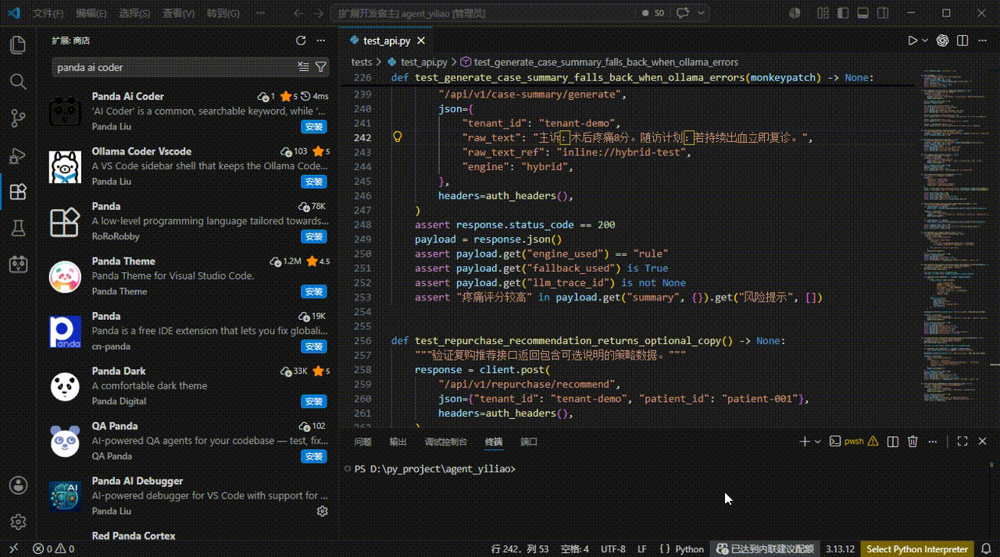

# Panda Ai Coder

Read in other languages:
[中文](README.zh.md) | [English](README.en.md)

<p>Author: Chenhui Liu</p>
<p align="left"></p>
<p>Tel/WeChat: 15799845845</p>

`Panda Ai Coder` is a VS Code sidebar extension that connects local Ollama or OpenAI-compatible model services to the editor, supports multi-threaded conversations around the current workspace, and can write project files directly when the model returns standard file blocks.



## Current Features

- Provides a dedicated `Panda Ai Coder` view in the Activity Bar
- Supports multi-task threads, recent tasks, history search, thread switching, and thread creation/deletion
- Supports both local Ollama and OpenAI-compatible `/v1` APIs
- Lets you save the service URL, authorization token, remote model name, and max token count in the sidebar settings
- Supports streaming output and continuously pushes deltas into the chat UI while a reply is being generated
- Automatically reads the current workspace tree and selects a small number of relevant file snippets based on the task, active editor, and attached paths
- Supports layered `AGENTS.md` instruction injection by discovering matching files upward from the workspace root, active file directory, and attachment directories
- Supports local `skills` discovery and automatically loads matching `SKILL.md` content for the current task; unmatched skills are still exposed as a lightweight catalog hint
- Supports stdio MCP servers configured via `mcp.json`, allowing the model to issue `<tool_call ...>` requests and continue the task with tool results
- When the model returns `<file path="...">...</file>` blocks, the extension builds a diff-based change set and supports apply, reject, and rollback; in "execute suggestion" mode it can auto-apply changes
- Displays token usage when the model API returns usage information

## What It Does Not Currently Support

The following capabilities are still not implemented in the current codebase and should not be promised externally:

- Explicit `@file` / `@folder` mention parsing
- Command execution, test runs, and lint feedback loops
- Git integration, Web Search, and sub-agents
- VS Code `Settings` page integration via `contributes.configuration`

At the moment, service configuration lives in the extension's own sidebar settings panel rather than the global VS Code Settings UI.

## How It Works

After activation, the extension registers two commands:

- `panda-ai-coder.openSidebar`
- `panda-ai-coder.newThread`

Main workflow:

1. Open `Panda Ai Coder` from the Activity Bar.
2. Configure the model service URL in the settings panel.
3. If you are using a remote OpenAI-compatible service, optionally set an authorization token, remote model name, and max token count.
4. Refresh the model list and choose a model.
5. Enter a task description in the current thread and send it.
6. The extension builds context from the current thread and workspace, then sends the request to the model service.
7. Before sending, it also assembles three extension capability layers:
   - `AGENTS.md` instruction layer
   - `skills` capability layer
   - `MCP` tool layer
8. If the model returns plain text, the reply is displayed directly.
9. If the model returns `<tool_call ...>`, the extension invokes the corresponding MCP tool and feeds the result back to the model so it can continue the task.
10. If the model returns `<file path="relative/path">` blocks, the extension creates a pending change set and either waits for approval or writes the files depending on the current mode.

## Supported Model Services

### 1. Local Ollama

Default URL:

```text
http://127.0.0.1:11434/api
```

The extension first tries to fetch the model list through the API. If the local Ollama API is unavailable and the service is not in OpenAI mode, it also tries:

```bash
ollama list
```

### 2. OpenAI-Compatible APIs

If the service URL path contains `/v1`, the extension treats it as an OpenAI-compatible API and uses:

- `POST /chat/completions`
- `GET /models`

The authorization token is automatically normalized to the `Bearer <token>` format and stored in VS Code Secret Storage.

## File Writing Protocol

The current version expects the model to return file content in the following format:

```xml
<file path="src/example.ts">
export const message = 'hello';
</file>
```

Requirements:

- `path` must be a relative workspace path
- Absolute paths are not allowed
- Paths cannot escape the workspace directory
- Binary files are not suitable

The extension strips these `<file>` blocks before showing the remaining explanation in chat, and appends a summary of the files that were written.

## AGENTS.md Support

The extension automatically looks for `AGENTS.md` in these locations:

- The workspace root
- The active file directory and its parent directories
- Attachment directories and their parent directories

Matched `AGENTS.md` files are injected into the system prompt from outer scope to inner scope. This is a good place for:

- Project-wide rules
- Subdirectory coding conventions
- Special module-specific guidance

## Skills Support

The extension automatically scans for `SKILL.md` files in:

- `<workspace>/.codex/skills`
- `<workspace>/.panda/skills`
- `<workspace>/skills`
- `~/.codex/skills`
- `~/.panda/skills`

It selects the most relevant skills based on the thread title and the latest user message, injects their content into the prompt, and exposes unmatched skills as a lightweight catalog so the model still knows what capabilities exist locally.

## MCP Support

The current version supports stdio MCP servers configured through a workspace `mcp.json` or any of these paths:

- `.vscode/mcp.json`
- `.cursor/mcp.json`
- `.codex/mcp.json`
- `.panda/mcp.json`
- `.mcp.json`
- `mcp.json`

Minimal example:

```json
{
  "mcpServers": {
    "filesystem": {
      "command": "node",
      "args": ["./scripts/mcp-filesystem.js"],
      "cwd": "${workspaceFolder}"
    }
  }
}
```

Supported template variables:

- `${workspaceFolder}` / `${workspaceRoot}`
- `${configDir}`
- `${userHome}`
- `${env:NAME}`

When the model needs to call a tool, it emits:

```xml
<tool_call server="filesystem" name="read_file">
{"path":"src/extension.ts"}
</tool_call>
```

The extension executes that call and feeds the tool result back into the conversation so the model can continue and finish the task.

## Known Limitations

- Only stdio MCP servers are supported; SSE and HTTP transports are not supported yet
- MCP invocation currently depends on the model producing the agreed `<tool_call>` tag format rather than native OpenAI function calling
- `skills` currently loads `SKILL.md` content only; it does not recursively execute scripts or route into extra skill resources yet
- Only the first workspace folder is processed
- Automatically attached code context has size and quantity limits
- Some internal names still keep the `ollamaCoder` prefix for historical reasons, but this does not affect functionality

## Requirements

- VS Code `^1.109.3`
- Node.js and npm
- Local Ollama, or any reachable OpenAI-compatible model service

## License

This project is licensed under the [MIT License](LICENSE).
